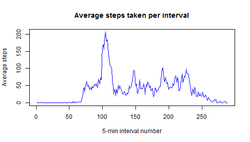
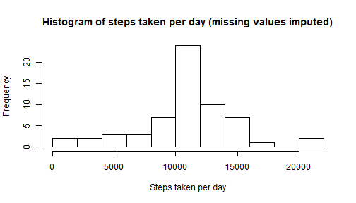
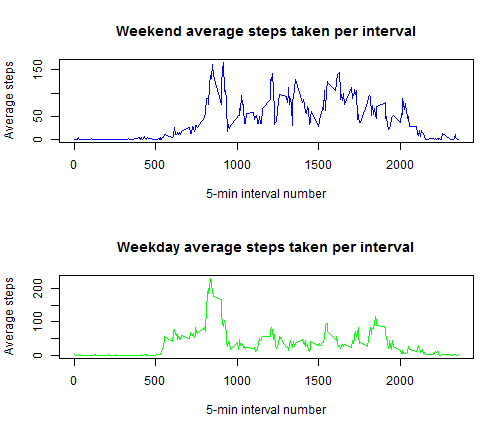

# Reproducible Research: Peer Assessment 1  


## Loading and preprocessing the data  
### Unzip the *activity.zip* file and load *activity.csv* into the *activity* variable:

```r
activity <- read.csv(unz("activity.zip", "activity.csv"), header=T)
```
### Convert the date column to Date format:

```r
activity[,"date"] <- as.Date(activity[,"date"])
```

## What is mean total number of steps taken per day?  
### Generate histogram of total steps taken each day and calculate mean and median:

```r
frequencies <- tapply(activity$steps,activity$date,sum)
hist(frequencies,breaks="FD",main="Histogram of steps taken per day",xlab="Steps taken per day")
```

 

```r
stepsmean <- mean(frequencies, na.rm=T)
stepsmedian <- median(frequencies, na.rm=T)
```
The **mean** total number of steps taken per day is *1.0766 &times; 10<sup>4</sup>*.  
The **median** total number of steps taken per day is *10765*.

## What is the average daily activity pattern?  
### Calculate the average steps taken per interval and plot it:

```r
intervalmeans <- tapply(activity$steps,activity$interval,mean,na.rm=T)
plot(intervalmeans, type="l", main="Average steps taken per interval", xlab="5-min interval number", ylab = "Average steps", col="blue")
```

 

```r
maxindex <- which.max(intervalmeans)
maxinterval <- intervalmeans[maxindex]
```
The 5-min interval with the **maximum average number of steps taken** is interval *104* with *206.1698* steps taken on average.

## Imputing missing values  
### Calculate the total number of missing values in the dataset:

```r
missingnum <- sum(is.na(activity[,"steps"]))
```
There are a **total** of *2304* missing values in the dataset.

### Impute the missing values using the mean of the corresponding intervals:

```r
activity.new <- activity 
NA.indices <- which(is.na(activity[,"steps"]))
for(index in NA.indices) {
  interval.mean.index <- which(activity[index,"interval"]==names(intervalmeans))
  activity.new[index,"steps"] <- intervalmeans[interval.mean.index]
}
frequencies.new <- tapply(activity.new$steps,activity.new$date,sum)
hist(frequencies.new,breaks="FD",main="Histogram of steps taken per day (missing values imputed)",xlab="Steps taken per day")
```

 

```r
stepsmean.new <- mean(frequencies.new, na.rm=T)
stepsmedian.new <- median(frequencies.new, na.rm=T)
```
The new **mean** total number of steps taken per day is *1.0766 &times; 10<sup>4</sup>*. Old was *1.0766 &times; 10<sup>4</sup>*.  
The new **median** total number of steps taken per day is *1.0766 &times; 10<sup>4</sup>*. Old was *1.0766 &times; 10<sup>4</sup>*.  

Only the **median** value was affected by imputing the missing values.  
Also, by imputing missing values, the daily steps taken for some days was increased since the missing values added 0.

## Are there differences in activity patterns between weekdays and weekends? 
Create a new factor variable in the dataset with two levels - "weekday" and "weekend" indicating whether a given date is a weekday or weekend day:

```r
days <- weekdays(activity.new[,"date"])
weekend.indices <- which(days=="Saturday" | days=="Sunday")
days[weekend.indices] <- "Weekend"
days[-weekend.indices] <- "Weekday"
activity.new[,"day"] <- factor(days)
intervalmeans.weekday <- aggregate(steps ~ interval + day, activity.new, mean, subset=which(activity.new[,"day"]=="Weekday"))
intervalmeans.weekend <- aggregate(steps ~ interval + day, activity.new, mean, subset=which(activity.new[,"day"]=="Weekend"))
par(mfrow=c(2,1)) 
plot(intervalmeans.weekend[,c(1,3)], type="l", main="Weekend average steps taken per interval", xlab="5-min interval number", ylab = "Average steps", col="blue")
plot(intervalmeans.weekday[,c(1,3)], type="l", main="Weekday average steps taken per interval", xlab="5-min interval number", ylab = "Average steps", col="green")
```

 

**Observe that the person is more active during the weekend.**
